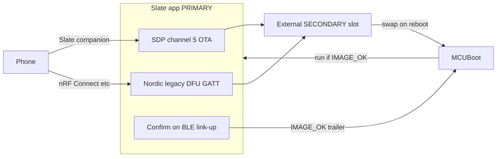

# M15 — OTA, MCUBoot, recovery

## Architecture decisions (locked)

- **MCUBoot is out-of-tree.** This repo ships the flash map, signing scripts, pubkey embedding, and app-side download/confirm/DFU. Full Mynewt/`pinetime-mcuboot-bootloader` stays a separately built binary flashed once (factory / SWD on a tear-down kit). Same model as InfiniTime: bootloader swaps; app fills secondary.
- **Confirm = successful Slate BLE session**, not reset alone: call `boot_set_confirmed()` only after a **central is connected** and the Slate GATT/`ble::Link` path is up (hook from real link-up — today’s [`main.cpp`](src/main.cpp) calling `on_link_up` at boot is **not** confirmation).
- **Nordic legacy DFU is mandatory and independent of SDP:** a DFU GATT service in the app that writes the **same** external secondary slot and requests reboot into MCUBoot, so nRF Connect / Gadgetbridge / Amazfish work when the Slate companion or channel-5 protocol is broken. Bootloader-resident DFU (button hold → recovery) is documented as the second net for “app won’t boot / BLE dead.”
- **OTA protocol** mirrors the existing ASSET receiver pattern in [`asset_xfer.hpp`](include/asset_xfer.hpp) / [`asset_xfer.cpp`](src/asset_xfer.cpp) (BEGIN/CHUNK/COMMIT, credit/ACK/NAK, resume by offset).

## 1. Flash layout (explicit)

Authoritative constants in new [`include/flash_map.hpp`](include/flash_map.hpp); document the same table in [`docs/ota.md`](docs/ota.md).

**Internal flash (512 KiB)**

| Region | Address | Size | Notes |
|---|---|---|---|
| MCUBoot | `0x00000000` | `0x8000` (32 KiB) | Bootloader binary |
| PRIMARY slot | `0x00008000` | `0x50000` (320 KiB) | MCUBoot image (hdr+body+TLV+trailer) |
| Scratch | `0x00058000` | `0x1000` (4 KiB) | MCUBoot swap scratch |
| Reserved | `0x00059000` | `0x26000` (152 KiB) | Spare / future |
| App persist | `0x0007F000` | `0x1000` (4 KiB) | Existing NVMC settings ([`CMakeLists.txt`](CMakeLists.txt) `SLATE_PERSIST_FLASH_ADDR`) |

**External SPI NOR (4 MiB)**

| Region | Address | Size | Notes |
|---|---|---|---|
| SECONDARY slot | `0x00000000` | `0x58000` (352 KiB) | OTA/DFU target; ≥ primary + padding |
| Recovery image | `0x00058000` | `0x28000` (160 KiB) | Bootloader-loaded recovery FW (optional factory content) |
| LittleFS | `0x00080000` | `0x380000` (~3.5 MiB) | Assets / logs — **offset remapped** |

Linker: default **`BOOTLOADER_PRESENT=ON`**; set `SLATE_FLASH_ORIGIN=0x8000`, `SLATE_FLASH_LENGTH=0x50000` (primary only — not “rest of chip”). Update [`docs/bringup.md`](docs/bringup.md).

Remap LittleFS in [`src/lfs_fs.cpp`](src/lfs_fs.cpp): `block_count` / address = `flash_map::kLfsOffset + block * sector` (breaking format change — document wipe-on-upgrade).

## 2. ECDSA-P256 signing

- `bootloader/keys/README.md`: generate with `imgtool keygen -k slate_priv.pem -t ecdsa-p256`; **never commit private key**; commit only public key.
- Embed public key as `bootloader/keys/slate_pub.pem` + generated [`src/mcuboot_pubkey.cpp`](src/mcuboot_pubkey.cpp) (or `.der` → C array) for MCUBoot verify config / app sanity checks.
- Script [`scripts/sign_firmware.py`](scripts/sign_firmware.py) (or `.ps1` wrapper): `imgtool sign --key … --header-size 32 --align 4 --slot-size 0x50000 --version … --pad-header` → `slate-signed.bin`.
- Document packing Nordic DFU zip: `adafruit-nrfutil dfu genpkg --dev-type 0x0052 --application slate-signed.bin slate-dfu.zip`.

## 3. Swap-with-revert + confirm-on-BLE

- MCUBoot config notes in [`bootloader/mcuboot-config.md`](bootloader/mcuboot-config.md): swap-using-scratch, `MCUBOOT_VALIDATE_PRIMARY_SLOT`, ECDSA-P256, **revert if not confirmed within N=3 boots** (`BOOT_MAX_IMG_SECTORS` / swap status).
- App library [`include/boot_util.hpp`](include/boot_util.hpp) + [`src/boot_util.cpp`](src/boot_util.cpp):
  - Detect pending confirm (image magic / trailer state).
  - `confirm_image()` writes MCUBoot `IMAGE_OK` in the primary trailer (sector-safe NVMC write).
  - **Only** invoked from a new `ble` link-up callback when a central connects and Slate RX/TX is live — **not** from `main()` startup.
- Until confirmed, do not treat boot as permanent; document that failing BLE for N boots → MCUBoot reverts to previous image left in secondary after swap.

## 4. OTA channel 5 receiver

New [`include/ota_xfer.hpp`](include/ota_xfer.hpp) / [`src/ota_xfer.cpp`](src/ota_xfer.cpp), wired in [`src/main.cpp`](src/main.cpp) `on_app_message` for `kChanOta`:

| Op | Dir | Payload |
|---|---|---|
| `BEGIN` | phone→watch | transfer_id, total_len, sha256[32], image_version |
| `CHUNK` | phone→watch | offset, data |
| `ABORT` / `COMMIT` | phone→watch | |
| `CREDIT` / `ACK` / `NAK` | watch→phone | same shape as ASSET |

Rules:
- Refuse `BEGIN` if `battery::percent() < 30` (and not charging) → NAK `LowBattery`.
- Write only into secondary via [`include/ota_slot.hpp`](include/ota_slot.hpp) (`erase`/`program` on XT25 secondary range).
- Resume: `BEGIN` with same id + `ACK` carrying `bytes_received`; reject overlapping/out-of-order like ASSET.
- `COMMIT`: verify SHA-256 over written bytes; set MCUBoot pending flag / image trailer so next reset swaps; then reboot.
- Host tests: [`tests/host/test_ota_xfer.cpp`](tests/host/test_ota_xfer.cpp) (battery gate, resume, hash fail).

## 5. Nordic legacy DFU (independent path)

- New [`include/dfu_nordic.hpp`](include/dfu_nordic.hpp) / [`src/dfu_nordic.cpp`](src/dfu_nordic.cpp): Nordic **legacy** DFU service UUIDs (start/packet/control), state machine that streams application image into **secondary slot** (same `ota_slot` writer), validates size ≤ slot, then resets.
- Register alongside Slate GATT in NimBLE path ([`src/ble_nimble.cpp`](src/ble_nimble.cpp)); stub/harness when `SLATE_HAS_NIMBLE=0` so host tests can drive the parser.
- Docs: how to DFU with nRF Connect / Gadgetbridge / Amazfish using `slate-dfu.zip`; emphasize this path does **not** use SDP channel 5.
- Bootloader recovery (button → recovery image with DFU) documented as the path when the **app** never starts.

## 6. Documentation ([`docs/ota.md`](docs/ota.md))

Must include:
- Flash tables (above)
- Signing + private-key handling
- Confirm-on-BLE definition and N=3
- Recovery procedures: bad image, interrupted transfer, boots-but-no-connect, corrupted bootloader
- **Brick enumeration** — every sealed-brick scenario and the specific defense (table)

Example brick rows (expanded in doc):

| Failure | Defense |
|---|---|
| Unsigned / wrong-key image | MCUBoot ECDSA-P256 reject |
| Truncated / wrong hash OTA | COMMIT hash + no swap |
| OTA mid-transfer power loss | Resume; secondary not marked pending until COMMIT |
| New image boots, BLE broken | No `IMAGE_OK` → revert after ≤N boots |
| Slate protocol bug, BLE OK | Nordic legacy DFU → secondary → swap |
| App hard-bricked (no BLE) | Bootloader button → recovery image DFU |
| Bootloader corrupted | **No field recovery** on sealed unit — factory SWD only; mitigate by never OTA’ing bootloader, APPROTECT after factory flash |
| Update at low battery | 30% gate |
| LittleFS wipe on map change | Documented; assets re-synced from phone |

## Implementation order

1. `flash_map.hpp` + CMake/`BOOTLOADER_PRESENT=ON` + LittleFS offset  
2. `ota_slot` + SHA-256 helper + `ota_xfer` + main/BLE wire-up + host tests  
3. `boot_util` confirm-on-link-up  
4. `dfu_nordic` + GATT registration  
5. Signing scripts + pubkey + `docs/ota.md` / `bootloader/*`  
6. Release build verify under `BOOTLOADER_PRESENT=ON`
