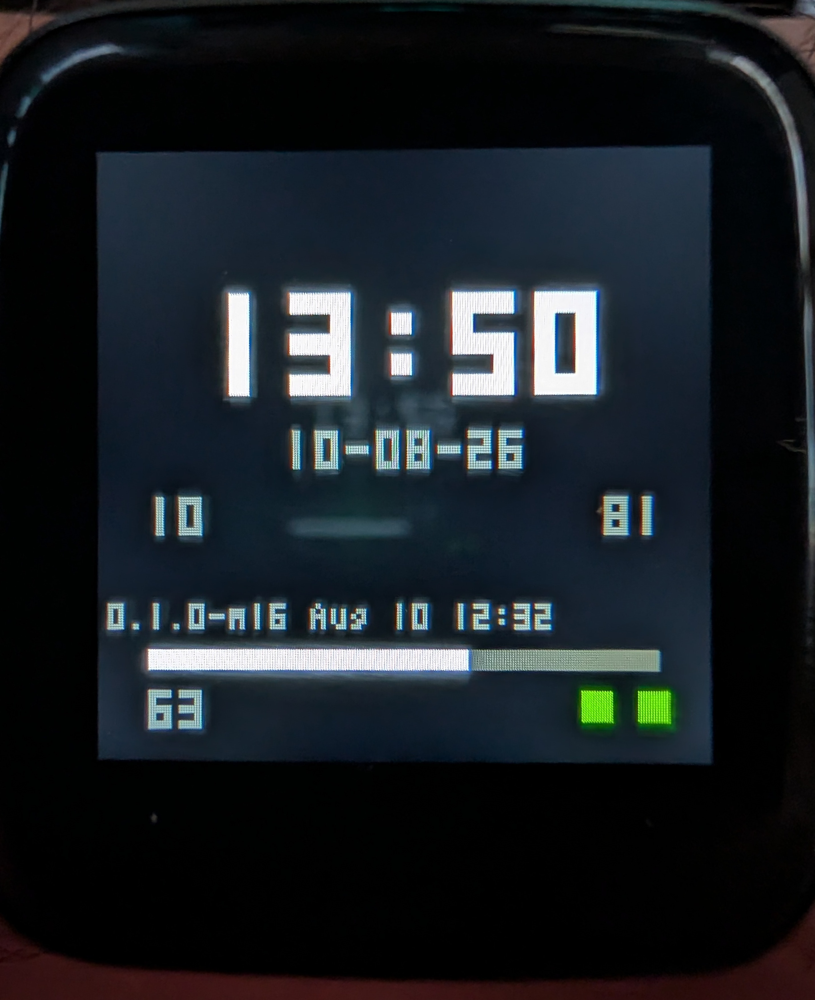
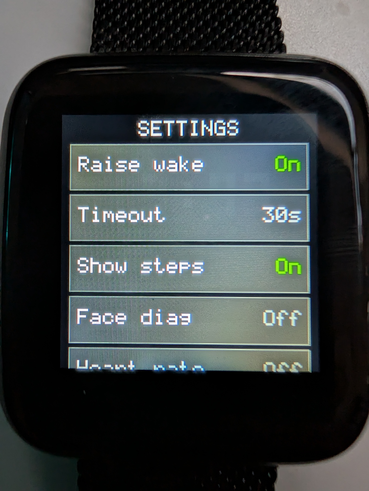
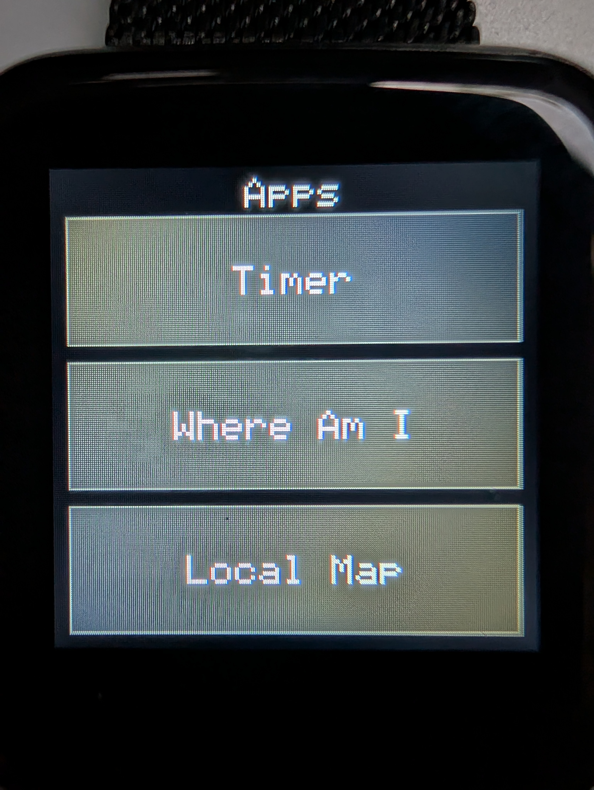

# SlateOS

**Thin-client smartwatch firmware for the [PineTime](https://pine64.org/devices/pinetime/), plus an Android companion app and a JS sub-app ecosystem.**

 
  

SlateOS, based on Pine's own InfiniTime at the low level, is a departure from the traditional smartwatch OS, in that it literally turns your PineTime into a slate for your phone. It also brings apps to your PineTime! How? well, we ususally install and run apps on our smartwatches, treating them as a full blown computing devices. But smartwatches conserve power by not having the beefiest CPUs and memories. And we usually have our phones nearby when we wear our smartwatches. So why not let the phones do all of the heavy lifting?

The Slate companion app acts as a bridge on your phone, running Javascript sub-apps, which render on your PineTime and which you can interact with on the watch. Many of will be able to (vibe)code a JS sub-app. I can't wait to see what you come up with!

Forgot your phone? No worry? SlateOS supports watch face, step counter and heart rate monitor in its offline mode.

Navigation: Swipe left for the app launcher, right for settings.

The phone pushes display lists over Bluetooth; the watch renders them and returns element-level input. A local resilient core (face, steps, settings, sleep/wake, OTA) keeps working with no phone attached. The watch never executes code received over BLE — display lists are data only.

| | |
|---|---|
| **MCU** | Nordic nRF52832 (Cortex-M4F, 512 KB flash, 64 KB RAM) |
| **Firmware** | FreeRTOS + NimBLE + LittleFS + MCUBoot, C++17 |
| **Companion** | Kotlin, Jetpack Compose, raw `android.bluetooth`, JS sub-apps in V8 |
| **Protocol** | SDP (Slate Display Protocol) — see `slate-implementation-roadmap.md` §4 |

<!--
  Screenshots: drop files under docs/images/ then uncomment / adjust paths below.
  Example after adding docs/images/face.jpg and docs/images/companion.png:

  
  

  Side-by-side on GitHub:

  | Watch | Phone |
  | :---: | :---: |
  |  |  |
-->

## What’s in the box

```
src/ include/     Watch firmware
companion/        Android app + SDP Kotlin core, emulator, tests
docs/             Operator manuals, OTA, I2C rules, capabilities
shared/           Wire/font assets shared by codegen
scripts/          DFU packaging, tooling
bootloader/       MCUBoot / key notes for sealed installs
```

**Highlights (today)**

- Sealed install from InfiniTime via Nordic legacy DFU; later updates over SDP OTA
- Local face (time, steps, optional heart-rate BPM), scrollable settings, raise-to-wake
- Phone compositor + JS sub-apps (timer, map, navigation demos, …)
- Dual 240×8 tile renderer — no full framebuffer (RAM hard limit)

Capability map (keep this honest): [`docs/capabilities.md`](docs/capabilities.md).

## Quick start

### Companion (Android)

```powershell
cd companion
.\gradlew.bat :app:installDebug
```

Details: [`companion/README.md`](companion/README.md). Associate the watch with Companion Device Manager, grant Bluetooth / notification access, then connect from the app.

### Firmware DFU zip (sealed PineTime)

```powershell
cmake -S . -B build/dfu -G Ninja `
  -DCMAKE_TOOLCHAIN_FILE=cmake/toolchain-arm-none-eabi.cmake `
  -DCMAKE_BUILD_TYPE=RelWithDebInfo `
  -DBOOTLOADER_PRESENT=ON
cmake --build build/dfu --target slate_dfu
```

Output: `build/dfu/slate-dfu.zip`. Flash while InfiniTime (or recovery) is running — see [`docs/flash-sealed.md`](docs/flash-sealed.md). Once Slate is running, prefer in-app **Update Slate firmware (SDP OTA)**.

### Host tests (no hardware)

```powershell
cmake -S . -B build/host-tests -G Ninja
cmake --build build/host-tests
ctest --test-dir build/host-tests -E ble_link
```

```powershell
cd companion
.\gradlew.bat :sdp-tests:test
```

## Documentation

| Doc | Topic |
|-----|--------|
| [`docs/operator-manual.md`](docs/operator-manual.md) | Using the watch day to day |
| [`docs/companion-manual.md`](docs/companion-manual.md) | Phone app |
| [`docs/flash-sealed.md`](docs/flash-sealed.md) | First install on a sealed PineTime |
| [`docs/ota.md`](docs/ota.md) | SDP OTA and flash map |
| [`docs/i2c-bus.md`](docs/i2c-bus.md) | Shared I2C rules (touch / accel / HR) |
| [`docs/subapp-rules.md`](docs/subapp-rules.md) | JS sub-app budgets and policy |
| [`docs/ble.md`](docs/ble.md) | GATT / mbuf notes |
| [`CLAUDE.md`](CLAUDE.md) | Project conventions for contributors and agents |

Roadmap / protocol: [`slate-implementation-roadmap.md`](slate-implementation-roadmap.md).

## Architecture (short)

```text
┌─────────────┐   SDP over BLE    ┌──────────────────┐
│  Companion  │ ◄───────────────► │  PineTime/Slate  │
│  (Android)  │  display lists    │  tile renderer   │
│  JS host    │  input events     │  local face/core │
└─────────────┘                   └──────────────────┘
```

Low-level bring-up and recovery lean on [InfiniTime](https://github.com/InfiniTimeOrg/InfiniTime) patterns (MCUBoot map, WDT, radio). High-level UI and apps are Slate’s own thin-client model.

## Adding screenshots for GitHub

1. Create image files under **`docs/images/`** (PNG or JPEG; keep each under ~1 MB if you can).
2. Commit them with the repo (GitHub serves them from the branch).
3. In this README (or any markdown file), use a **relative** path:

```markdown

```

Optional width (GitHub accepts HTML in README):

```html

```

Side-by-side:

```markdown
| Watch | Phone |
| :---: | :---: |
|  |  |
```

Do **not** paste `file:///…` or absolute Windows paths — they will not render for anyone else. Prefer paths relative to the repo root when linking from `README.md`.

After push, open the repo on GitHub and confirm the images load on the default branch.

## Status / contributing

This is an active research and product bring-up tree. Expect sharp edges; prefer the docs above and [`docs/issue-prompts-open.md`](docs/issue-prompts-open.md) over guessing.

Hardware pinout and hard constraints are authoritative in [`CLAUDE.md`](CLAUDE.md) — do not invent alternate SPI/I2C wiring.
